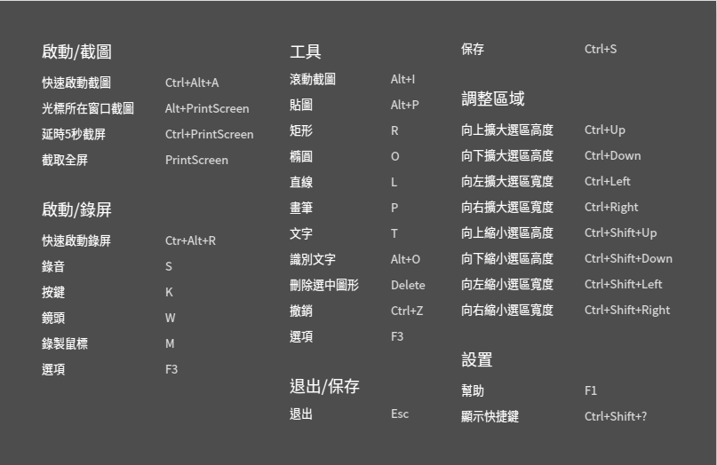
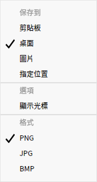

# 螢幕錄影|deepin-screen-recorder|

## 概述

螢幕錄影是一款集截圖、錄屏於一體的小巧工具，不僅支持多種方式來選擇截圖錄屏區域，還支持對圖片進行編輯，對螢幕活動進行設置等功能。

## 使用入門

通過以下方式運行、關閉螢幕錄影，同時還可以創建快捷方式。

### 運行螢幕錄影

1. 單擊任務欄上的啟動器圖標 ，進入啟動器界面。
2. 上下滾動鼠標滾輪瀏覽或通過搜索，找到螢幕錄影圖標 ，單擊運行。
3. 右鍵單擊 ，您可以：

   - 單擊 **傳送到桌面**，在桌面創建快捷方式。
   - 單擊 **傳送到任務欄**，將應用程序固定到任務欄。
   - 單擊 **加至開機啟動**，將應用程序添加到開機啟動項，在電腦開機時自動運行該應用。

### 關閉螢幕錄影

- 螢幕錄影會在截圖或錄影結束後自動退出。
- 在螢幕錄影界面，單擊，關閉應用。
- 在截圖界面，單擊鼠標右鍵，選擇 **保存** 或 **退出**。

### 快捷鍵

使用快捷鍵 **Ctrl + Shift + ?** 打開快捷鍵預覽界面。熟練地使用快捷鍵，將大大提升您的操作效率。

## 選擇和調整區域

### 選擇截圖錄屏區域

螢幕錄影支持全螢幕、程序窗口和自選區域的選擇。在螢幕錄影時選中對應的區域，該區域會高亮顯示，且周圍會出現白色虛線邊框。

> 說明：當電腦多屏顯示時，您也可以使用螢幕錄影來截取不同螢幕上的區域。

#### 選擇全螢幕

螢幕錄影會自動識別當前顯示器的整個螢幕。

&nbsp;&nbsp;&nbsp;&nbsp;&nbsp;&nbsp;&nbsp;&nbsp;&nbsp;&nbsp;&nbsp;&nbsp;&nbsp;

您可以通過以下步驟來選擇全螢幕：

1. 使用快捷鍵 **Ctrl + Alt + A** 進入截圖模式，或 **Ctrl + Alt + R** 進入錄屏模式。
2. 將鼠標指針移至桌面上，截圖錄屏會自動選中整個螢幕，並在其左上角顯示當前截圖錄屏區域的尺寸大小。
3. 鼠標左鍵單擊桌面，彈出工具欄。

您也可以直接操作以下步驟來進行全螢幕截圖：

- 如果您已經將截圖錄屏固定到任務欄，右鍵單擊任務欄上的圖標，選擇 **全屏截圖** 。
- 按下鍵盤上的 鍵，實現全螢幕截圖。

#### 選擇窗口

螢幕錄影會自動識別當前的應用窗口。

&nbsp;&nbsp;&nbsp;&nbsp;&nbsp;&nbsp;&nbsp;&nbsp;&nbsp;&nbsp;&nbsp;&nbsp;&nbsp;

1. 使用快捷鍵 **Ctrl + Alt + A** 進入截圖模式，或 **Ctrl + Alt + R** 進入錄屏模式。
2. 將鼠標指針移至打開的應用窗口上，螢幕錄影會自動選中該窗口，並在其左上角顯示當前截圖錄屏區域的尺寸大小。
3. 鼠標左鍵單擊窗口，彈出工具欄。

#### 自選區域

您還可以自由選擇螢幕錄影的範圍。

&nbsp;&nbsp;&nbsp;&nbsp;&nbsp;&nbsp;&nbsp;&nbsp;&nbsp;&nbsp;&nbsp;&nbsp;&nbsp;

1. 使用快捷鍵 **Ctrl + Alt + A** 進入截圖模式，或 **Ctrl + Alt + R** 進入錄屏模式。
2. 按住鼠標左鍵不放，拖動鼠標選擇螢幕錄影區域，在其左上角實時顯示當前截圖區域的尺寸大小。
3. 釋放鼠標左鍵完成截圖區域選擇，彈出工具欄。

### 調整螢幕錄影區域

您可以對螢幕錄影區域進行微調，例如放大縮小截取範圍，移動選區位置等。

#### 放大/ 縮小區域

- 將鼠標指針置於螢幕錄影區域的白色邊框上，鼠標指針變為 ，
按住鼠標左鍵不放，拖動鼠標來放大或縮小螢幕錄影區域。
- 按下鍵盤上的 **Ctrl** +  或  來上下擴展區域，按下鍵盤上的 **Ctrl** +  或  來左右擴展區域。

&nbsp;&nbsp;&nbsp;&nbsp;&nbsp;&nbsp;&nbsp;&nbsp;&nbsp;&nbsp;&nbsp;&nbsp;&nbsp;

#### 移動區域位置

將鼠標指針置於螢幕錄影區域上，鼠標指針為 ，您可以：
- 按住鼠標左鍵不放，拖動鼠標來移動區域的位置。
- 按下鍵盤上的 或 來上下移動區域，按下鍵盤上的 或 來左右移動區域。

## 截圖

在截圖模式下，單擊工具欄上的按鈕，您可以在截圖區域繪製圖形、編輯圖形、添加文字批註等。

<table class="block1">
    <caption>工具欄說明</caption>
    <tbody>
        <tr>
            <td></td>
            <td>矩形工具</td>
            <td></td>
            <td>橢圓工具</td>
            <td></td>
            <td>線條工具</td>
        </tr>
          <tr>
            <td></td>
            <td>畫筆工具</td>
            <td></td>
            <td>文本工具</td>
            <td></td>
            <td>退出截圖</td>
        </tr>
    </tbody>
</table>

> 說明：如果您已經對工具欄和屬性欄中，如線條粗細、字體大小等進行了設置，截圖會保存該設置。再次啟動截圖錄屏，將默認使用該設置，您也可以重新進行選擇。

### 繪製圖形

通過截圖工具欄上的按鈕可繪製簡單的圖形，選擇圖形工具後，按住鍵盤上 **Shift** 鍵，拖動鼠標繪製正方形、圓形或水平/垂直方向的直線和帶箭頭的直線。

#### 矩形工具

&nbsp;&nbsp;&nbsp;&nbsp;&nbsp;&nbsp;&nbsp;&nbsp;&nbsp;&nbsp;&nbsp;&nbsp;&nbsp;

1. 在截圖工具欄中，單擊 。
2. 在工具欄展開面板中，選擇矩形邊線的粗細和顏色，有四種顏色可供選擇。
3. 將鼠標指針置於截圖區域上，鼠標指針變為 。
4. 按住鼠標左鍵不放，拖動鼠標完成圖形區域的繪製。
5. 如果截圖中包含了個人私隱訊息，請單擊工具欄展開面板中的  或  來塗抹。

&nbsp;&nbsp;&nbsp;&nbsp;&nbsp;&nbsp;&nbsp;&nbsp;&nbsp;&nbsp;&nbsp;&nbsp;&nbsp;

&nbsp;&nbsp;&nbsp;&nbsp;&nbsp;&nbsp;&nbsp;&nbsp;&nbsp;&nbsp;&nbsp;&nbsp;&nbsp;

#### 橢圓工具

&nbsp;&nbsp;&nbsp;&nbsp;&nbsp;&nbsp;&nbsp;&nbsp;&nbsp;&nbsp;&nbsp;&nbsp;&nbsp;

1. 在截圖工具欄中，單擊 。
2. 在工具欄展開面板中，選擇橢圓邊線的粗細和顏色，有四種顏色可供選擇。
3. 將鼠標指針置於截圖區域上，鼠標指針變為 。
4. 按住鼠標左鍵不放，拖動鼠標完成圖形區域的繪製。
5. 如果截圖中包含了個人私隱訊息，請單擊工具欄展開面板中的  或  來塗抹。

#### 直線和箭頭工具

&nbsp;&nbsp;&nbsp;&nbsp;&nbsp;&nbsp;&nbsp;&nbsp;&nbsp;&nbsp;&nbsp;&nbsp;&nbsp;

1. 在截圖工具欄中，單擊 。
2. 在工具欄展開面板中，選擇線條的粗細和顏色，有四種顏色可供選擇。
3. 單擊  或 ，在直線和箭頭之間切換。
4. 將鼠標指針置於截圖區域上，鼠標指針變為  或 。
5. 按住鼠標左鍵不放，拖動鼠標完成圖形區域的繪製。

#### 畫筆工具

&nbsp;&nbsp;&nbsp;&nbsp;&nbsp;&nbsp;&nbsp;&nbsp;&nbsp;&nbsp;&nbsp;&nbsp;&nbsp;

1. 在截圖工具欄中，單擊 。
2. 在工具欄展開面板中，選擇畫筆的粗細和顏色，有四種顏色可供選擇。
3. 將鼠標指針置於截圖區域上，鼠標指針變為 。
4. 按住鼠標左鍵不放，拖動鼠標完成圖形區域的繪製。

### 修改圖形
如果您在截圖中繪製了其他的圖形，可以對繪製的圖形進行修改和移動。

&nbsp;&nbsp;&nbsp;&nbsp;&nbsp;&nbsp;&nbsp;&nbsp;&nbsp;&nbsp;&nbsp;&nbsp;&nbsp;

#### 移動圖形
1. 將鼠標指針置於圖形的邊線上，此時鼠標指針變為 。
2. 按住鼠標左鍵不放，將圖形移動到截圖區域的任何位置。
3. 按下鍵盤上的  或  來上下移動圖形，按下鍵盤上的  或  來左右移動圖形。

#### 編輯圖形
1. 將鼠標指針置於圖形的邊線上，此時鼠標指針變為 。
2. 單擊鼠標左鍵，進入圖形的編輯模式，您可以：
   - 按下鍵盤上的 **Delete** 鍵，刪除圖形。
   - 將鼠標指針置於編輯框上，此時鼠標指針變成 ，通過拖動鼠標指針來放大或縮小圖形區域。
   - 按下鍵盤上的 **Ctrl** +  或  來上下擴展圖形區域，按下鍵盤上的 **Ctrl** +  或  來左右擴展圖形區域。
   - 將鼠標指針置於編輯框的  上，此時鼠標指針變成 ，通過拖動鼠標指針來旋轉圖形。
3. 在編輯框外單擊鼠標左鍵，退出編輯模式。

### 添加文字批註

對截取的圖片進行文字補充和說明，幫助他人更清楚地了解截取的圖片。

&nbsp;&nbsp;&nbsp;&nbsp;&nbsp;&nbsp;&nbsp;&nbsp;&nbsp;&nbsp;&nbsp;&nbsp;&nbsp;

1. 在截圖工具欄中，單擊 。
2. 在工具欄展開面板中，選擇字號和顏色，有四種顏色可供選擇。
3. 將鼠標指針置於截取的圖片上，此時鼠標指針變為 。
4. 單擊要添加批註的地方，會出現一個待輸入的文本框。
5. 在文本框中輸入文字。

### 修改文字批註

如果您已經添加了文字批註，可以對文字批註進行修改和移動。

#### 移動文字批註

1. 將鼠標指針置於文字上，此時鼠標指針變為 。
2. 按住鼠標左鍵不放，可以將文字移動到截圖區域的任何位置。

#### 編輯文字批註
1. 將鼠標指針置於文字上，此時鼠標指針變為 。
2. 雙擊鼠標左鍵，進入文字編輯模式，您可以：
   - 按下鍵盤上的 **Delete** 鍵，刪除文字批註。
   - 在文本框內，修改文字訊息。
3. 在文本框外單擊鼠標左鍵，退出編輯模式。

### 延時截圖

您可以通過延時截圖功能，捕捉特定狀態或時間下的螢幕內容。

- 將截圖錄屏圖標固定在任務欄，右鍵單擊圖標，選擇 **延時截圖**。
- 使用快捷鍵 **Ctrl** + ，啟動延時截圖。
- 在終端中執行命令 “deepin-screen-recorder -d n”，其中n表示以秒為單位的延時時長。

### 保存截圖
將截取的圖片保存下來，為後續的使用儲存素材！

當截圖保存成功之後，在桌面上方彈出提示訊息，單擊 **查看**，打開截圖所在的文件夾。

開啟截圖錄屏，選定截圖區域後，通過執行以下操作之一來保存圖片：

- 雙擊鼠標左鍵來保存。
- 單擊截圖工具欄中的 按鈕。
- 按下鍵盤上的 **Ctrl + S** 組合鍵來保存。
- 在截取的圖片中，單擊鼠標右鍵，選擇 **保存**。

   > 說明：在以上操作中，截取的圖片默認存放到剪貼板。

您還可以在截圖工具欄中，單擊 **選項** 的下拉選項：

&nbsp;&nbsp;&nbsp;&nbsp;&nbsp;&nbsp;&nbsp;&nbsp;&nbsp;&nbsp;&nbsp;&nbsp;&nbsp;

- 選擇 **剪貼板**，將圖片保存到剪貼板中。
- 選擇 **桌面**，將圖片保存到桌面。
- 選擇 **圖片**，截圖文件自動保存到圖片文件夾目錄下。
- 選擇 **指定位置**，截圖文件將保存到用戶設定的文件夾目錄下。
- 選擇 **顯示光標**，光標在截圖區域內，截圖生成圖片時會同時顯示光標所在的位置和樣式。
- 選擇 **PNG/JPG/BMP**，設置圖片格式。

## 錄屏

在錄屏模式下，單擊錄屏工具欄上的按鈕，您可以錄製聲音、鏡頭畫面、按鍵顯示、鼠標單擊等。

<table class="block1">
    <caption>工具欄說明</caption>
    <tbody>
        <tr>
            <td></td>
            <td>麥克風</td>
            <td></td>
            <td>系統音頻</td>
            <td></td>
            <td>顯示按鍵</td>
            <td></td>
            <td>開啟鏡頭</td>
        </tr>
          <tr>
            <td></td>
            <td>顯示光標</td>
            <td></td>
            <td>顯示點擊</td>
            <td></td>
            <td>退出錄屏</td>
            <td></td>
            <td></td>
        </tr>
    </tbody>
</table>

> 說明：SW平台不支持錄屏功能。

### 錄屏設置

在錄屏工具欄中，您可以：

- 錄製聲音：在錄製聲音下拉選項中選擇開啟 **麥克風** 或 **系統音頻**，也可以全部選擇。
- 顯示按鍵：單擊按鈕 ，錄屏時顯示鍵盤按鍵操作，最多同時顯示5個按鍵操作。
- 開啟鏡頭：單擊按鈕  ，啟動鏡頭，錄屏時同時錄製鏡頭畫面和螢幕畫面，拖拽鏡頭窗口可以調整位置。

   > 注意：請先檢測接入的設備是否支持聲音錄製或鏡頭功能，若不支持，則無法進行相應的操作。

- 錄製鼠標操作：在錄製鼠標下拉選項中可以選擇 **顯示光標** 或 **顯示點擊**，也可以全部選擇。
- 選項：在 **選項** 下拉選項中選擇 **GIF** 、 **MP4** 或 **MKV** 影片格式，並選擇影片幀率。

   > 說明：MIPS架構不支持GIF格式。

### 錄製影片

通過以下步驟，捕捉螢幕活動。

1. 使用快捷鍵 **Ctrl + Alt + R** 啟動錄屏。
2. 選擇錄屏區域。
3. 在錄屏工具欄中，對錄屏進行相關的設置。
4. 單擊  按鈕，3秒倒計時結束後開始錄製，此時托盤區域出現錄製圖標並閃爍。
5. 您可以使用以下方法結束錄製：
   - 使用快捷鍵 **Ctrl + Alt + R**。
   - 單擊任務欄上的螢幕錄影圖標。
   - 單擊托盤區域錄製圖標。

錄製結束後影片將自動保存到桌面。

> 說明：
>- 當任務欄在桌面的上方或下方時，托盤區域的錄製圖標會顯示錄製時長。
>- 在錄製影片時，如果接入多屏顯示器，不論多屏顯示器為複製模式還是擴展模式，僅針對當前操作屏進行錄屏。

## 查看幫助手冊

啟動螢幕錄影後按下鍵盤上的 **F1** 鍵即可打開幫助手冊。

